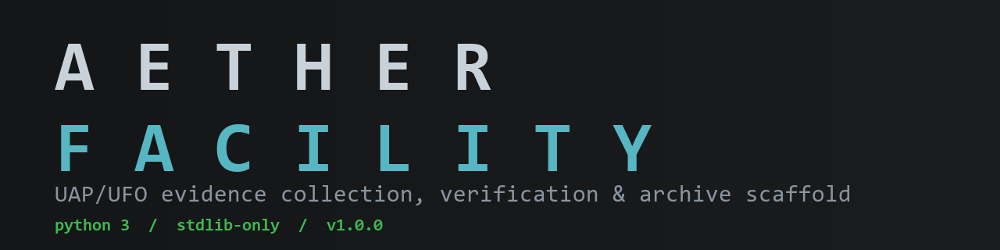
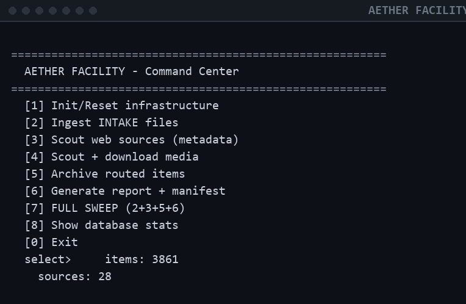
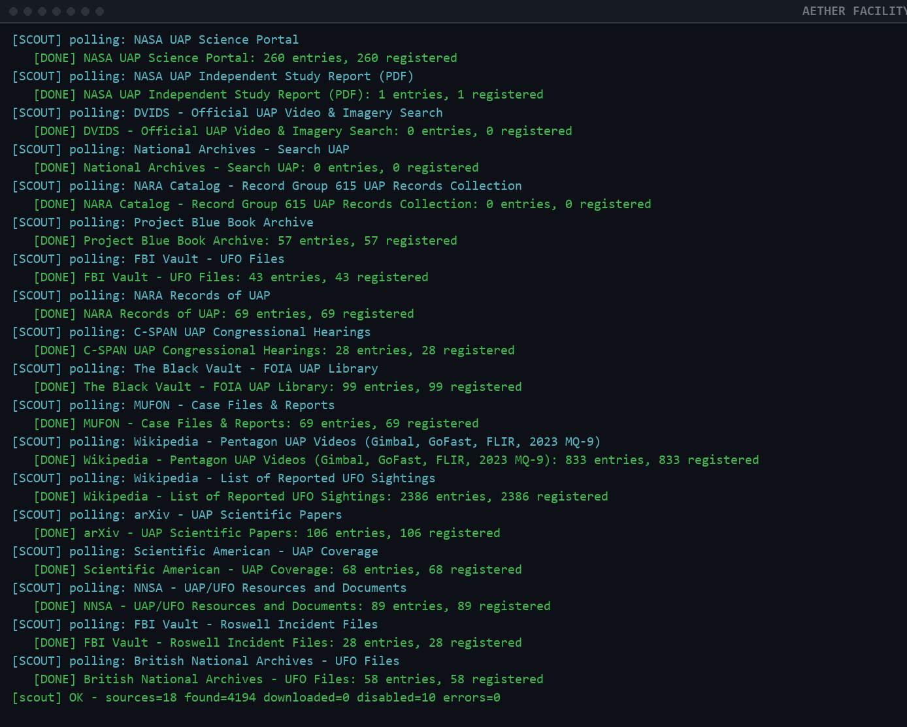
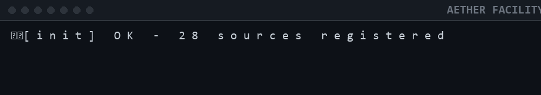
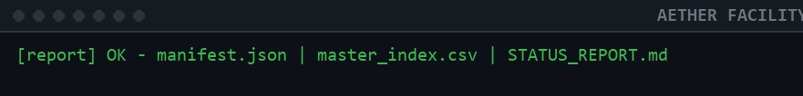

<p align="center">
  
</p>

<h1 align="center">AETHER FACILITY</h1>

<p align="center">
  <strong>Military-grade research scaffold for collecting, verifying, and organizing public UFO/UAP videos, documents, and images — all in one place.</strong>
</p>

<p align="center">
  <a href="LICENSE"></a>
  
  
  
</p>

---

AETHER FACILITY is a self-contained, stdlib-only Python tool that polls vetted public
sources (NASA, NARA, FBI Vault, C-SPAN hearings, arXiv, and more), fingerprints every
item with SHA-256 for integrity and de-duplication, routes verified material into a
curated archive, and regenerates a human-readable status report.

| Feature | |
| --- | --- |
| Runtime | Python 3.8+ · **zero pip dependencies** · single-file `.exe` available |
| Sources | 28 vetted public/government sources (18 active) |
| Integrity | SHA-256 fingerprinting, automatic de-duplication & quarantine |
| Output | `STATUS_REPORT.md`, `master_index.csv`, JSON manifest, SQLite index |
| License | [MIT](LICENSE) |

---

## Screenshots

Command Center menu             | Scout sweep (live indexing)
:------------------------------:|:------------------------------:
 | 

Bootstrap                     | Reporting
:----------------------------:|:--------------------------------:
 | 

---

## Quick start

### Option A — Standalone exe (recommended)

1. Download `AETHER_FACILITY.exe` from the [latest release](../../releases/latest).
2. Drop it next to a folder containing `CONFIG.json` and `_DATA/sources.json`
   (i.e. keep it inside the facility root, as shipped).
3. Double-click `AETHER_FACILITY.exe` and select `[7] FULL SWEEP`.

### Option B — From source

```bat
cd AETHER_FACILITY
START_FACILITY.bat        REM one-click launcher
```

or directly:

```bat
python _SCRIPTS\facility.py menu
```

---

## Workflow

```
┌──────────┐     ┌──────────┐     ┌──────────┐     ┌──────────────┐
│  INGEST  │ ──> │  SCOUT   │ ──> │ ARCHIVE  │ ──> │   REPORT     │
│ INTAKE\  │     │ sources  │     │ routed   │     │ .md + .csv   │
└──────────┘     └──────────┘     └──────────┘     └──────────────┘
```

1. **Ingest** — anything dropped into `INTAKE\` is registered and fingerprinted
   (SHA-256). Duplicates are auto-quarantined.
2. **Scout** — polls 18 vetted active sources (NASA, Navy/DVIDS, NARA incl. Record
   Group 615, FBI Vault, C-SPAN hearings, Black Vault, MUFON, arXiv, NNSA, British
   National Archives). `--download` pulls media into `INTAKE\`. Bot-walled sources
   (AARO, Congress.gov, GAO, Senate, DIA, CIA, NUFORC) are auto-skipped with notes.
3. **Archive** — items route into `ARCHIVE\` by classification: verified footage →
   `authenticated`, FOIA docs → `declassified`, reports → `government_reports`, etc.
4. **Report** — regenerates `REPORTING\STATUS_REPORT.md`, `master_index.csv`, and
   `_DATA\manifest.json`.

---

## CLI

```
python _SCRIPTS\facility.py init        bootstrap the facility
python _SCRIPTS\facility.py ingest      register INTAKE files
python _SCRIPTS\facility.py scout       index sources (metadata)
python _SCRIPTS\facility.py scout --download   pull media from sources
python _SCRIPTS\facility.py archive     route intake items into ARCHIVE
python _SCRIPTS\facility.py report      regenerate report + manifest
python _SCRIPTS\facility.py run_once    init + ingest + scout + archive + report
python _SCRIPTS\facility.py menu        interactive control panel
```

---

## Directory map

```
AETHER_FACILITY/
├─ START_FACILITY.bat        <- double-click to launch
├─ CONFIG.json               <- network / storage / routing rules
├─ _CORE/                    <- engine: db.py, vault.py, scout.py, report.py
├─ _SCRIPTS/facility.py      <- command center (CLI)
├─ _DATA/
│  ├─ master.db              <- SQLite master index (SHA-256 fingerprints)
│  ├─ sources.json           <- 28 sources (18 active / 10 bot-walled)
│  ├─ manifest.json          <- full JSON manifest of all items
│  └─ logs/
├─ INTAKE/                   <- drop files here; raw captures
│  ├─ raw_video/  raw_docs/  unsorted/  quarantine/
├─ ARCHIVE/                  <- routed, organized holdings
│  ├─ video/  (authenticated / confirmed / unconfirmed / debunked)
│  ├─ documents/ (government_reports / declassified / scientific_papers /
│  │              news_articles / eyewitness_reports)
│  └─ images/
├─ PROCESSED/                <- transcripts / analysis / summaries
├─ REPORTING/                <- STATUS_REPORT.md + master_index.csv
└─ docs/
```

---

## Building the exe

```bat
pip install pyinstaller
cd AETHER_FACILITY
python -m PyInstaller --onefile --name AETHER_FACILITY --paths _CORE _SCRIPTS\facility.py
```

The standalone exe resolves `CONFIG.json`, `_DATA/`, etc. relative to its own
location, so keep it inside the facility root.

---

## Notes & ethics

- Sources are public/government sites; the scout uses a polite rate limit and captures
  **metadata by default**. Enable `"download": true` in `CONFIG.json` to pull files.
- Every item is SHA-256 fingerprinted; integrity and dedup are automatic.
- The `verified` flag marks items from government/published sources vs. unconfirmed
  reports. Always corroborate — this tool organizes evidence, it does not judge it.

---

## Contributing

Contributions are welcome. Please read [CONTRIBUTING.md](CONTRIBUTING.md) before opening a pull request.

---

## License

MIT — see [LICENSE](LICENSE).
